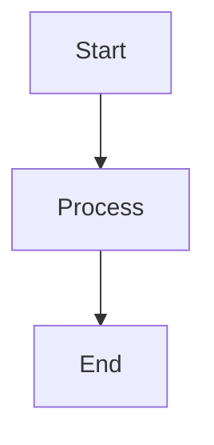

# Articles - Content Authoring Guide

This guide explains how to create and manage long-form articles in the Mongado Knowledge Base.

## Overview

Articles are static markdown files stored in source control, designed for:
- **Long-form content**: Curated essays, tutorials, reference guides
- **Professional polish**: Published, reviewed, well-structured content
- **Fast rendering**: Intelligent caching with hot-reload in dev
- **Optimized assets**: WebP images with long-term browser caching
- **Zero database**: All content loaded from filesystem at startup

## Directory Structure

```
backend/static/
├── articles/              # Markdown articles (source control)
│   ├── 001-topic.md
│   ├── 002-another-topic.md
│   └── ...
└── assets/               # Static media files (source control)
    ├── images/           # Article images (WebP format recommended)
    │   ├── diagram-01.webp
    │   └── screenshot-02.webp
    ├── icons/            # UI icons (SVG preferred)
    └── downloads/        # PDFs, ZIP files, etc.
```

## Creating Articles

### 1. Quick Start Template

**Copy this stub to create a new article:**

```markdown
---
id: 999
title: "Your Article Title Here"
tags: ["tag1", "tag2", "tag3"]
created_at: "2025-01-15T10:00:00"
---

## Your Article Title Here

Your content here...
```

**Required fields:**
- `id` - Unique integer (check existing articles, use next available number)
- `title` - Article title in quotes
- `created_at` - ISO 8601 timestamp format: `"YYYY-MM-DDTHH:MM:SS"`

**Optional fields:**
- `tags` - Array of tags for categorization
- `url` - Reference URL for source material
- `description` - Brief summary (used for metadata/SEO)
- `category` - Category slug (e.g., "knowledge-management")
- `published` - Boolean, defaults to true

**IMPORTANT:** Use `created_at` (not `date`) - this is the field the article loader expects!

### 2. Full Article Format Example

Articles use Markdown with YAML frontmatter metadata:

```markdown
---
id: 1
title: "Understanding SaaS Billing Models"
description: "A comprehensive guide to subscription pricing strategies"
url: "https://stripe.com/billing"
tags: ["saas", "billing", "pricing"]
created_at: "2025-01-15T10:00:00"
---

## Your article title

Your markdown content here...

### Subsections

- Bullet points
- **Bold text**
- *Italic text*
- [Links](https://example.com)

### Images


### Code blocks

\`\`\`python
def hello():
    print("Hello, world!")
\`\`\`

### Linking to Notes

You can reference Zettelkasten notes using wikilink syntax:

See [[curious-elephant]] for more details on database design.
```

### 3. Frontmatter Field Reference

**Required:**
- `id` (integer): Unique identifier - use next sequential number
- `title` (string): Article title in quotes

**Recommended:**
- `created_at` (string): Timestamp in ISO 8601 format `"YYYY-MM-DDTHH:MM:SS"`
- `tags` (array): List of tags like `["tag1", "tag2"]`

**Optional:**
- `url` (string): Reference URL for source material
- `description` (string): Brief summary for metadata/SEO
- `category` (string): Category slug
- `published` (boolean): Defaults to true if omitted

### 4. File Naming Convention

Use numbered prefixes for easy ordering:
- `001-first-article.md`
- `002-second-article.md`
- `003-third-article.md`

Files are loaded in alphabetical order.

## Adding Images

### Recommended Format: WebP

WebP provides excellent compression (25-35% smaller than JPEG/PNG) with broad browser support.

### Image Optimization Workflow

**Option 1: Using the built-in optimizer (Pillow)**

```bash
cd backend

# Single image
./venv/bin/python image_optimizer.py input.jpg output.webp 85 1200

# Batch convert directory
./venv/bin/python image_optimizer.py --batch path/to/images/
```

**Option 2: Manual conversion**

```bash
# Install WebP tools (macOS)
brew install webp

# Convert with cwebp
cwebp -q 85 -resize 1200 0 input.jpg -o output.webp
```

### Image Size Guidelines

- **Max width**: 1200px (maintains aspect ratio)
- **Quality**: 85 (good balance of size/quality)
- **Format**: WebP primary, PNG/JPEG fallback for older browsers

### Referencing Images in Articles

Always use absolute paths from the `/static` mount point:

```markdown

```

## Creating Diagrams

### Recommended Workflow

Instead of embedding diagram tools in the webapp, create diagrams externally and include as optimized images:

**1. Choose a diagram tool:**

- **Excalidraw** (excalidraw.com) - Hand-drawn style, simple and fast
  - Free, no login required
  - Export: PNG, SVG
  - Great for: Sketches, wireframes, quick diagrams

- **draw.io** (app.diagrams.net) - Professional diagrams
  - Free, desktop or web
  - Export: PNG, SVG, WebP
  - Great for: Architecture diagrams, flowcharts, network diagrams

- **Mermaid Live Editor** (mermaid.live) - Text-to-diagram
  - Write diagrams as code (like markdown)
  - Export: PNG, SVG
  - Great for: Flowcharts, sequence diagrams, ER diagrams
  - Can save code in comments for future edits

- **Figma** - Professional design tool
  - Export: PNG, SVG, WebP
  - Great for: Polished diagrams, UI mockups

- **Whimsical** (whimsical.com) - Collaborative diagrams
  - Beautiful preset styles
  - Great for: Flowcharts, mind maps

**2. Create and export:**

- Design your diagram
- Export as PNG or SVG (highest resolution available)
- Use descriptive filename: `billing-flow-diagram.png`

**3. Optimize and add to project:**

```bash
cd backend

# Optimize single diagram
./venv/bin/python image_optimizer.py ~/Downloads/my-diagram.png static/assets/images/my-diagram.webp

# The optimizer will:
# - Convert to WebP (smaller file size)
# - Resize to max 1200px width (if needed)
# - Maintain aspect ratio
```

**4. Reference in your article:**

```markdown
## System Architecture

Our system consists of three main components:


The diagram above shows...
```

### Diagram Best Practices

1. **Use descriptive alt text**: Helps accessibility and SEO
2. **Export high resolution**: Start with 2x size, optimizer will resize
3. **Keep it simple**: Complex diagrams are hard to read on mobile
4. **Use consistent style**: Pick one tool and stick with it
5. **Save source files**: Keep .drawio or .fig files for future edits
6. **Name meaningfully**: `user-auth-flow.webp` not `diagram-1.webp`

### When to Use Mermaid Later

If you find yourself creating many similar diagrams (like flowcharts or sequence diagrams), consider adding Mermaid.js support:

```markdown
<!-- Future: Render diagrams from text -->

```

But for now, keep it simple with static images!

## Caching Strategy

### Server-Side (Backend)

Articles are cached intelligently:
- **First load**: Parse all markdown files at startup
- **Subsequent requests**: Serve from memory cache
- **Dev mode**: Auto-reload when files change (checks modification time)
- **Production**: Cache persists until server restart

### Client-Side (Browser)

Cache headers are set for optimal performance:

| Path | Cache Duration | Use Case |
|------|----------------|----------|
| `/static/assets/*` | 1 year (immutable) | Images, icons, downloads |
| `/static/articles/*` | 1 hour (revalidate) | Markdown source files |
| `/api/resources` (GET) | 60 seconds | Article list/detail API |
| `/uploads/*` | 1 day | User-uploaded images |

**Key benefit**: Static assets are cached aggressively. Use content hashing in filenames for cache busting (e.g., `logo-v2.webp`).

## Performance Optimizations

### 1. Response Compression

All responses > 1KB are automatically gzip compressed by the backend.

### 2. Static Asset Serving

FastAPI's `StaticFiles` serves assets with:
- ETag support (conditional requests)
- Range request support (partial downloads)
- Efficient file streaming

### 3. Article Loading

- **Startup**: O(n) load all articles once
- **Runtime**: O(1) lookup from memory
- **Hash-based invalidation**: Only reload if files change

### 4. Future: Cloudflare CDN

When you add Cloudflare:
- Set Cache-Control headers (already implemented)
- Enable Auto Minify for HTML/CSS/JS
- Use Cloudflare's image optimization (optional alternative to WebP)
- Consider Cloudflare Workers for edge caching

## Adding New Articles

### Quick Start

1. **Create markdown file**:
   ```bash
   cd backend/static/articles
   nano 008-new-topic.md
   ```

2. **Add frontmatter and content**:
   ```markdown
   ---
   id: 8
   title: "My New Article"
   tags: ["new", "topic"]
   created_at: "2025-10-11T12:00:00"
   ---

   ## Content here
   ```

3. **Add images (if needed)**:
   ```bash
   # Optimize images
   cd backend
   ./venv/bin/python image_optimizer.py my-image.jpg static/assets/images/new-topic-01.webp
   ```

4. **Test locally**:
   ```bash
   make run
   # Visit http://localhost:8000/api/resources
   ```

5. **Commit to git**:
   ```bash
   git add backend/static/
   git commit -m "Add new Knowledge Base article"
   ```

### Development Tips

**Hot Reload**:
The backend automatically detects file changes (modification time) and reloads articles without restart.

**Viewing Changes**:
- API: `GET http://localhost:8000/api/resources`
- Single article: `GET http://localhost:8000/api/resources/8`
- Frontend: Visit Knowledge Base page

## API Endpoints

### List All Articles

```bash
GET /api/resources
```

Returns all articles (static + user-created).

### Get Single Article

```bash
GET /api/resources/{id}
```

Returns article with full markdown content.

### Search Articles

```bash
POST /api/search
{
  "query": "billing models",
  "top_k": 5
}
```

Semantic search using Ollama AI (if available).

### Ask Question

```bash
POST /api/ask
{
  "question": "What are common billing models?"
}
```

AI-powered Q&A using article content as context.

### Generate Summary

```bash
GET /api/articles/{id}/summary
```

AI-generated summary of the article (cached).

## Troubleshooting

### Articles not loading

1. Check file location: `backend/static/articles/*.md`
2. Verify frontmatter format (valid YAML)
3. Check server logs: `make run` shows load status
4. Ensure `id` field is unique integer

### Images not displaying

1. Verify path: `/static/assets/images/filename.webp`
2. Check file exists: `ls backend/static/assets/images/`
3. Test direct access: `http://localhost:8000/static/assets/images/filename.webp`
4. Check browser console for 404 errors

### Cache not updating

1. **Dev mode**: Should auto-reload (checks file mtime)
2. **Force reload**: Restart server
3. **Browser cache**: Hard refresh (Cmd+Shift+R / Ctrl+Shift+F5)
4. **Production**: Restart server or use cache-busting filenames

### Image optimization fails

```bash
# Install dependencies
./venv/bin/pip install Pillow

# Or use cwebp
brew install webp  # macOS
apt install webp   # Linux
```

## Best Practices

1. **Use WebP for images**: 25-35% smaller files
2. **Keep images under 200KB**: Optimize quality vs. size
3. **Use descriptive filenames**: `billing-flow-diagram.webp` not `image1.webp`
4. **Add alt text**: ``
5. **Version large changes**: Use git to track article history
6. **Test locally first**: Run `make run` and verify before committing
7. **Use consistent IDs**: Sequential integers (1, 2, 3...)
8. **Tag appropriately**: Makes search and filtering easier
9. **Link to notes**: Use `[[note-id]]` to reference related atomic notes

## Example Article Templates

### Technical Tutorial

```markdown
---
id: 10
title: "How to Deploy with Docker"
tags: ["docker", "deployment", "devops"]
created_at: "2025-10-11T12:00:00"
---

## Overview

Brief introduction to what this tutorial covers.

## Prerequisites

- Docker installed
- Basic command line knowledge

## Step 1: Setup

\`\`\`bash
docker pull nginx
\`\`\`

## Step 2: Configuration

Create a `Dockerfile`:

\`\`\`dockerfile
FROM nginx:alpine
COPY . /usr/share/nginx/html
\`\`\`

## Troubleshooting

Common issues and solutions.

## References

- [Docker Docs](https://docs.docker.com)
```

### Reference Article

```markdown
---
id: 11
title: "Engineering Management: 1-on-1 Best Practices"
url: "https://example.com/source"
tags: ["management", "leadership", "career"]
created_at: "2025-10-11T12:00:00"
---

## Key Principles

List of important concepts.

## Common Patterns

### Pattern 1: Weekly Cadence

Explanation...

### Pattern 2: Structured Agenda

Explanation...

## Pitfalls to Avoid

- Pitfall 1
- Pitfall 2

## Further Reading

- [Resource 1](https://example.com)
```

## Cross-Linking with Notes

Articles can reference Zettelkasten notes using wikilink syntax:

```markdown
For more atomic thoughts on this topic, see:
- [[curious-elephant]] - Database design patterns
- [[wise-mountain]] - Graph algorithms
- [[swift-river]] - Payment processing
```

The system will:
- Render these as clickable links to the note pages
- Show backlinks from notes that reference this article
- Include both in semantic search results
- Display connections in the graph visualization

See [NOTES.md](NOTES.md) for more details on the note system and wikilinks.

## Related Documentation

- **[README.md](README.md)** - Knowledge Base overview and architecture
- **[NOTES.md](NOTES.md)** - Zettelkasten note system guide
- **[../SETUP.md](../SETUP.md)** - Environment setup
- **[../TESTING.md](../TESTING.md)** - Testing tools and commands

---

For general development questions, see [CLAUDE.md](../../CLAUDE.md) and the root [README.md](../../README.md).
